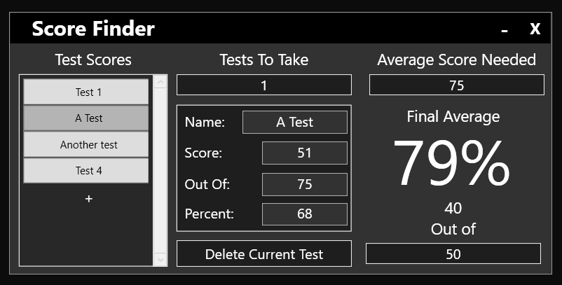

# Score-Finder

A program I made for fun to help find the needed score on the next test to make sure you pass. 
(Aka to help my mom figure out what people need to pass/if they have the ability to pass her nursing class, which is why the default score is set to 78%).

If the score needed is above 100%, the person fails with no chance of success (provided nothing is weighted and there is no extra credit)
If the score needed is below 0%, the person passes the said score even after getting a 0 on the following test(s).

# How to use

Add tests using the [+] button.

Remove the *selected* test with the "Delete Current Test" button.

The "Tests To Take" box is the number of tests you need to take to reach that score, the final result will be the *average* score needed for each of those test(s) to reach your desired average.

To set a score for the test, either set the "Score" box and the "Out Of" box to the number correct and total number of questions on the test ***OR*** set the "Percent" box to the percent correct obtained on the test.

Change the "Average Score Needed" box to the percent you want at the very minimum.

Change the "Out of" box at the bottom right to set the number of questions on the next test to see whats needed correct to reach the desired average.

The *average* score needed correct will be displayed as a big percent sign at the right of the ui as an alternative to the out of box explained above.
